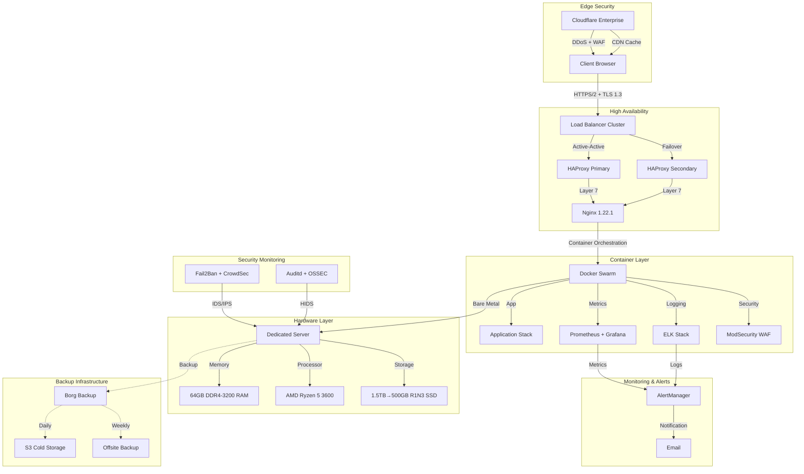

### ⚠️ IN REDACTION ⚠️
# LLM-Powered Portfolio Website (this file is currently not optimised for mobile devices). 

  

**Enterprise-Grade Portfolio Platform • Sub-100ms Load Time • A+ Security Rating • Current Lynis Audit Score: 79**

[Live Demo](https://lucaskemper.com)  

---

## 🎯 Performance Metrics (outdated)

| Metric | Value | Status |
|:------:|:-----:|:------:|
| Load Time | <100ms | ✅ |
| Lighthouse Score | 100/100 | ✅ |
| First Paint | <1s | ✅ |
| Uptime SLA | 99.9% | ✅ |
| System Load | <5% | ✅ |

---

## 🏗️ Architecture Overview

---

## 🚀 Feature Highlights

<strong>🎨 Modern UI/UX Components</strong>

- Particle.js background with dynamic interactions
- Matrix-style rain effect with canvas
- Custom animated cursor with dual-layer design
- 3D card effects with perspective transforms

<strong>⚡ Performance Optimizations</strong>

- Critical CSS inlining
- Preloading of key assets
- Async script loading
- WebP image optimization

<strong>🛡️ Security Measures</strong>

- TLS 1.3 with TLS_AES_256_GCM_SHA384
- HSTS with max-age=31536000
- Strict CSP headers
- Multi-layer WAF protection

